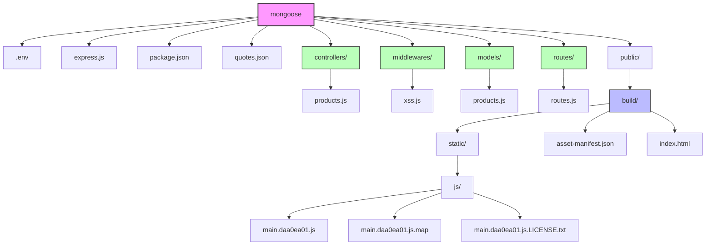
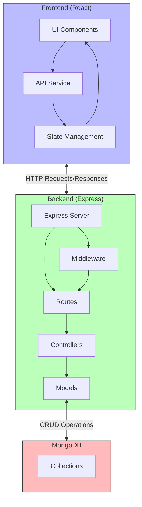
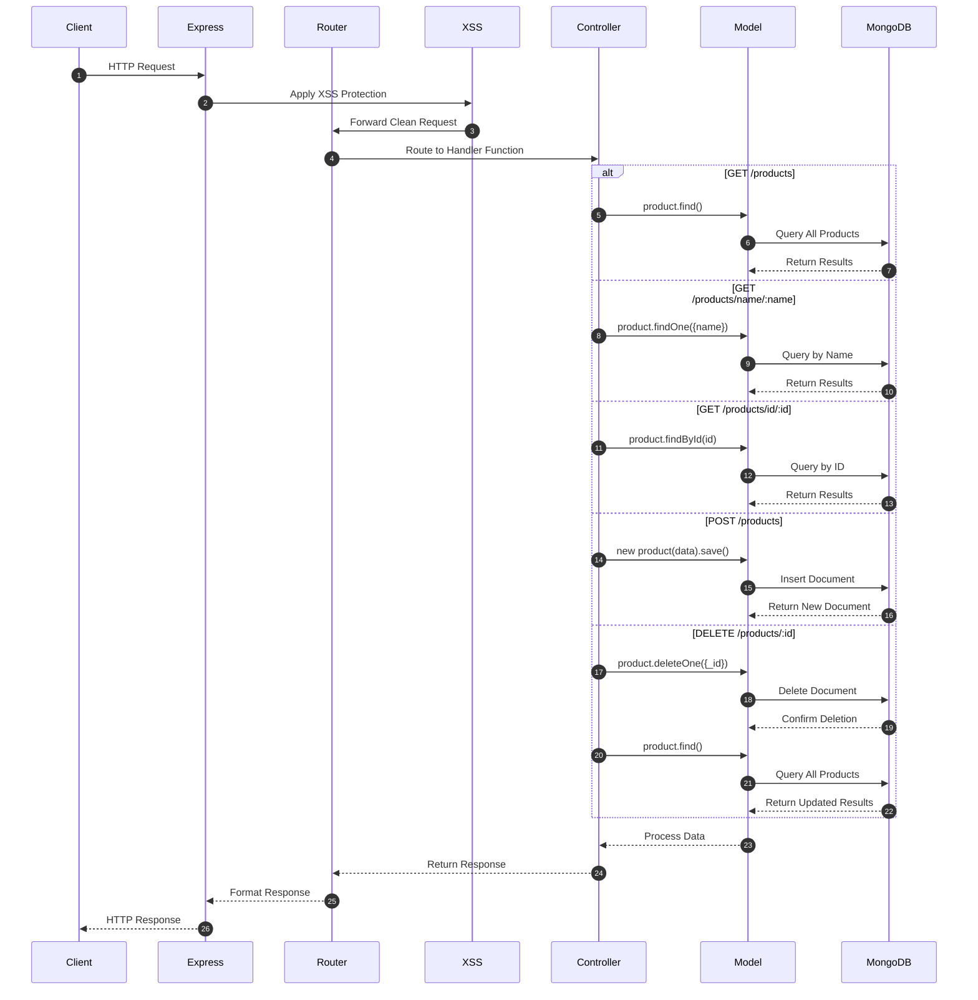
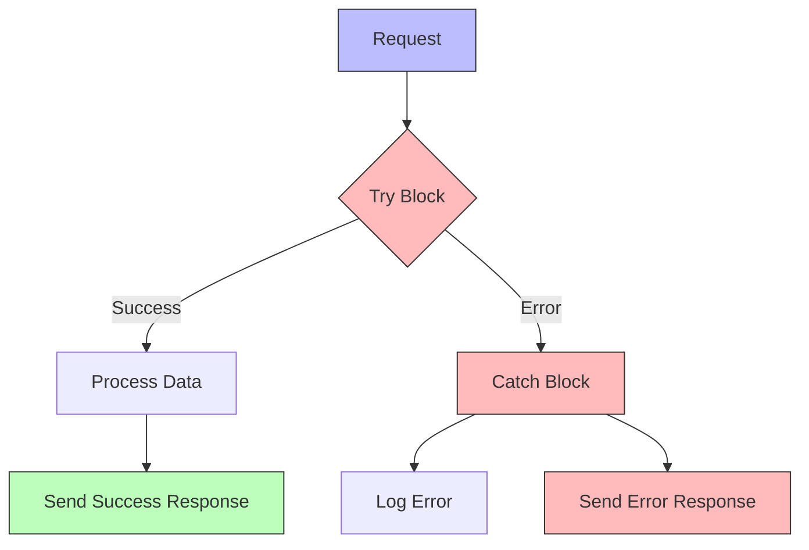
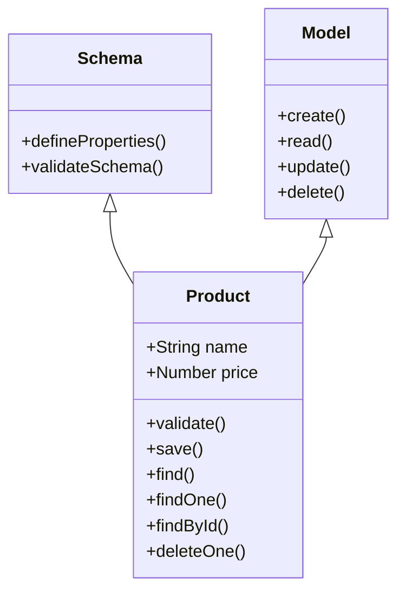
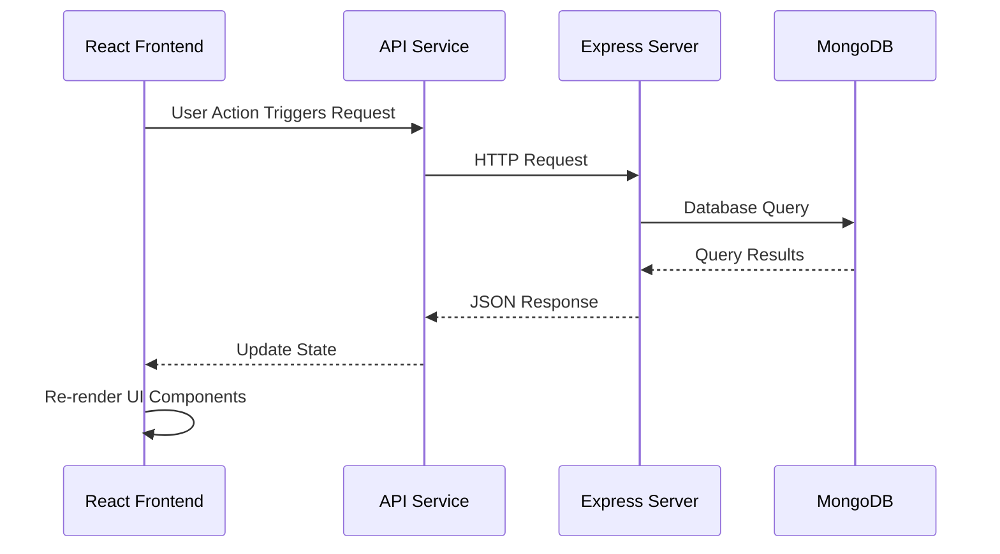
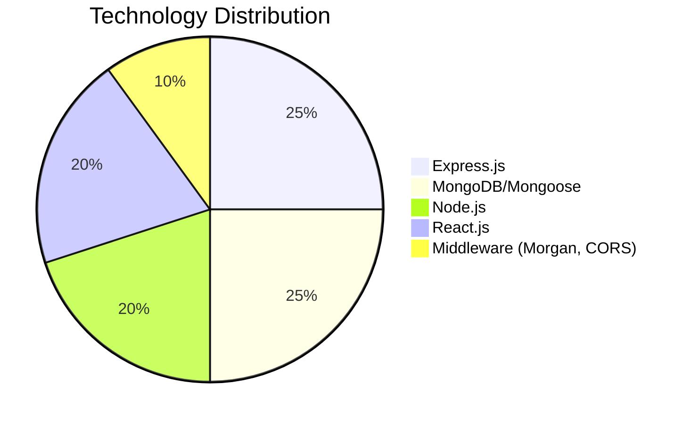
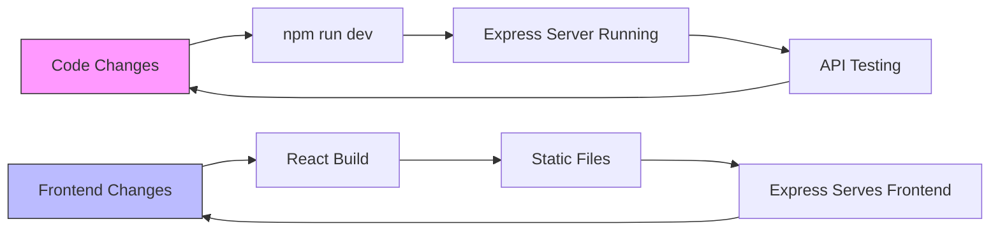

# Products API Visualization

This document provides comprehensive visual representations of the Products API project using Mermaid diagrams, including both backend and frontend components.

## Complete Project Structure



## Detailed Application Architecture



## Controller Functions Flow

```mermaid
flowchart TD
    A[Products Controller] --> B[readAll]
    A --> C[read]
    A --> D[readbyId]
    A --> E[create]
    A --> F[deleteobj]
    
    B -->|product.find()| G[Returns all products]
    C -->|product.findOne()| H[Returns product by name]
    D -->|product.findById()| I[Returns product by ID]
    E -->|product.save()| J[Creates new product]
    F -->|product.deleteOne()| K[Deletes product by ID]
    
    style A fill:#f96,stroke:#333,stroke-width:2px
    style B fill:#9f6,stroke:#333,stroke-width:1px
    style C fill:#9f6,stroke:#333,stroke-width:1px
    style D fill:#9f6,stroke:#333,stroke-width:1px
    style E fill:#9f6,stroke:#333,stroke-width:1px
    style F fill:#9f6,stroke:#333,stroke-width:1px
```

## API Request-Response Flow



## Error Handling Flow



## Data Model Schema



## Express Middleware Stack

```mermaid
flowchart LR
    Client([Client]) --> A[Request]
    A --> B[express.json()]
    B --> C[morgan]
    C --> D[cors]
    D --> E[XSS Protection]
    E --> F[Routes]
    F --> G[Response]
    G --> Client
    
    style A fill:#bbf,stroke:#333,stroke-width:1px
    style G fill:#bbf,stroke:#333,stroke-width:1px
    style F fill:#bfb,stroke:#333,stroke-width:1px
```

## Frontend-Backend Integration



## Technology Stack Breakdown



## Development Workflow



## How to View These Diagrams

1. Install the "Markdown Preview Mermaid Support" extension for your IDE (VS Code or Cursor).
2. Open this markdown file.
3. Use the "Markdown: Open Preview" command to view the rendered diagrams.
   - In Cursor: Look for a preview button in the editor toolbar or use Ctrl+Shift+V (Windows) or Cmd+Shift+V (Mac)
   - Alternatively, right-click on the file and select "Open Preview"
4. You can also use the "Markdown Preview Enhanced" extension which supports Mermaid diagrams.

## Notes

- The diagrams above are generated using Mermaid syntax.
- You may need to refresh the preview if changes are made to the diagrams.
- For more complex diagrams, refer to the [Mermaid documentation](https://mermaid-js.github.io/mermaid/#/).
- Colors in diagrams represent different components:
  - 🟣 Purple: Main project components
  - 🟢 Green: Backend components
  - 🔵 Blue: Frontend components
  - 🟠 Orange: Function groups
  - 🔴 Red: Database or error handling 